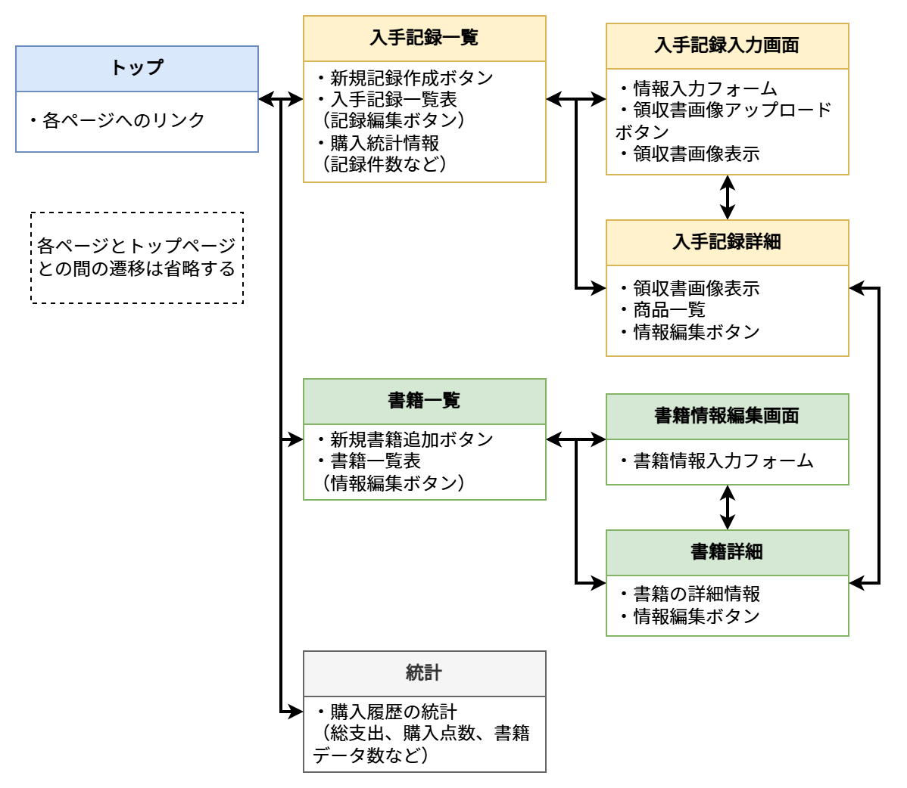
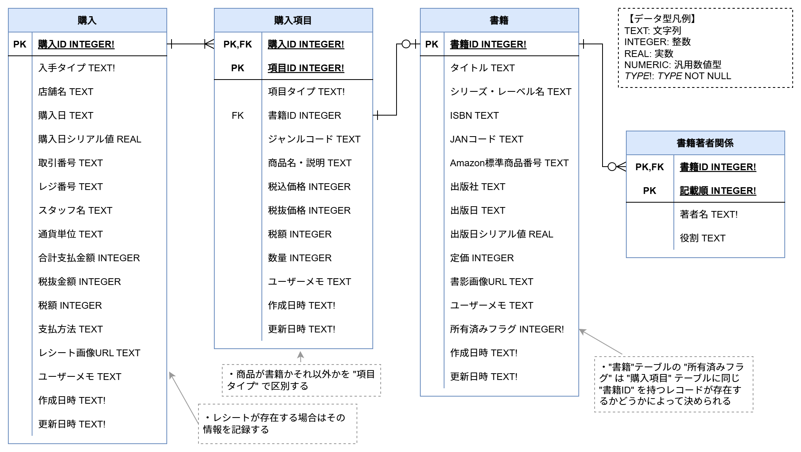

# LivreRecords

## 概要

書籍などを購入した際のレシート画像を読み取り、何を購入したかを管理するアプリ。Webアプリとして動作。

## 機能

### レシート読み取り機能

* 書籍購入時のレシートを撮影した画像からレシート情報を読み取る。
* 読み取りにはOCRを使用。
* 画像読み取り結果が不完全な場合でも、手入力で情報を修正可能。
* レシート情報をデータベースに格納し、リスト化して表示する。

### 購入履歴・書籍情報管理

* レシート情報をもとに、購入済みの本にマークを付けて管理する。
* 書籍情報はウェブAPIを用いて取得可能。

## 実行環境

- Python3
- Django
- opencv-python
- EasyOCR
- django-widget-tweaks

## 画面遷移図



## ER図



## インストール手順（作成中）

1. リポジトリをクローンします。

   ```bash
   git clone https://github.com/sm-miki/LivreRecords.git
   ```

   (作成途中)
