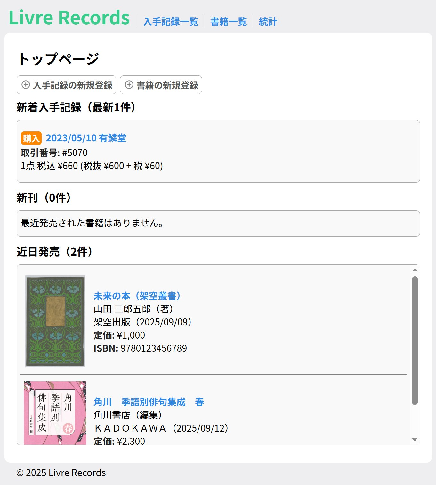

# LivreRecords



## 概要

LivreRecordsは、書籍の購入・入手記録を管理できるDjango製Webアプリです。  
レシート単位で書籍や品目の情報を登録し、OCRによるレシート読み取り機能も備えています。  
購入履歴の管理や統計表示、新刊告知など、個人の蔵書管理をサポートします。

## 主な機能

### 1. 入手記録管理

- **入手情報の登録**: 購入日、店舗名、支払金額、支払い方法など、レシートに記載されている情報を記録します。
- **項目内訳**: 1つの入手記録に複数の書籍やその他の品目を紐づけて管理できます。
- **レシート画像**: レシートの画像をアップロードし、記録と一緒に保管できます。

### 2. 書籍情報管理

- **書籍データベース**: タイトル、著者、ISBN、出版社、発売日、表紙画像など、書籍の詳細情報を登録・管理できます。
- **所有状況の追跡**: 紐づけられた購入記録がリスト表示されるため、特定の書籍をいつどこで入手したのたかを簡単に確認できます。

### 3. レシートOCR機能

- **レシート読み取り**: 入手記録の登録時、スマートフォンなどで撮影したレシート画像から記載されている情報を自動で抽出します。
    - 抽出結果を基に品目を簡単に追加でき、手入力の手間を削減します。
    - 現在はISBNの抽出にのみ対応していますが、将来的な機能拡張を考えています。

### 4. 統計・分析機能

- **サマリー表示**: これまでの累計購入冊数や登録書籍数などをダッシュボードで確認できます。

### 5. その他機能

- **新刊告知機能**: 登録された書籍のうち、近日中に発売予定または発売済みのものをトップページに表示することで、新刊の買い忘れを防ぎます。
- **洋書への対応**: 海外での購入や洋書の購入にも対応しています。円以外にドルなどの通貨単位も指定でき、入手日時にタイムゾーンを設定できます。
  
## 今後の機能追加

時間があれば、以下のような機能の追加・改善を考えています。

- レシート読み取り機能の精度向上、読み取り内容の拡張
- データの検索・フィルタ・並べ替え表示機能
- 書籍情報の自動取得機能
- 書籍のスコア付け機能
- 読書記録機能
- UIの改善
- ユーザー認証機能

## 使用技術

- **バックエンド**: Python3, Django
- **データベース**: SQLite
- **画像処理**: NumPy **(バージョン1.x系)**, Pillow, OpenCV-Python
- **OCR**: EasyOCR
- **フロントエンド**: HTML, CSS, JavaScript
- **その他ライブラリ**: django-widget-tweaks

## 設計資料

### 画面遷移図


### ER図


## 導入

### 0. 前提条件 (Prerequisites)

開発環境には以下のソフトウェアが必要です。

- Python 3.8 以降
- pip
- Git

### 1. リポジトリのクローン (Clone Repository)

プロジェクトをクローンしたい場所でターミナルを開き、以下のコマンドを実行します。

 ```bash
 git clone https://github.com/sm-miki/LivreRecords.git
 cd LivreRecords
 ```

### 2. 仮想環境の作成と有効化（任意）

必要であれば、仮想環境を作成して有効化します。

#### Windowsの場合

```bash
python -m venv venv
venv\Scripts\activate
```

#### macOS/Linuxの場合

```bash
python3 -m venv venv
source venv/bin/activate
```

### 3. 依存パッケージのインストール

```bash
pip install -r requirements.txt
```

### 4. シークレットキーの初期化

.envファイルにDjangoのSECRET_KEYを設定します。
`update_env_secret_key.sh` は新しいランダムなSECRET_KEYを生成し、.envファイルに書き込みます。

#### Windowsの場合

```bash
cd livre_manager
update_env_secret_key.sh
```

#### macOS/Linuxの場合

```bash
cd livre_manager
bash update_env_secret_key.sh
```

## 開発用サーバの起動

### 1. データベースの初期化

データベースの初期化のためのマイグレーションを実行します。

```bash
python manage.py makemigrations
python manage.py migrate
```

### 2. 管理ユーザーの作成（任意）

```bash
python manage.py createsuperuser
```

### 3. 開発サーバーの起動

```bash
python manage.py runserver
```

### 4. アクセス

ブラウザで `http://localhost:8000/` （またはコンソール上に表示されたアドレス）にアクセスし、ウェブページが表示されることを確認します。

## スクリーンショット

### 入手記録の編集とOCRの読み取り


### 入手記録の閲覧


### 統計表示


## ライセンス


[MIT © 2025 sm-miki](./LICENSE)
